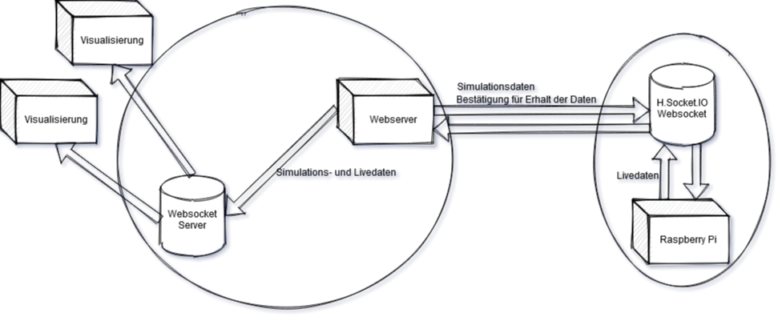

# Floating city!

## ToDo

- [ ] Merge all working develop branch to each main branch.
- [ ] Link all md's to parent README.md
- [ ] Link All README.md to this file

## Componetns
   
   - [RaspberryPi 4B (master)](https://github.com/TFBS-EKE-FloatingCity/Raspberry)
   - [Visualisation (Server/Client)](https://github.com/TFBS-EKE-FloatingCity/visualizationWeb)
   - 3x [Microcontrollers ](https://github.com/TFBS-EKE-FloatingCity/FCController)
   - 6x ultrasonic sensor
   - 6x Pumps (3 for out and 3 for in)
   - 6x LEDstrips
   - Router for network

## Communication

[Read more](Kommunikation.md)

## General
